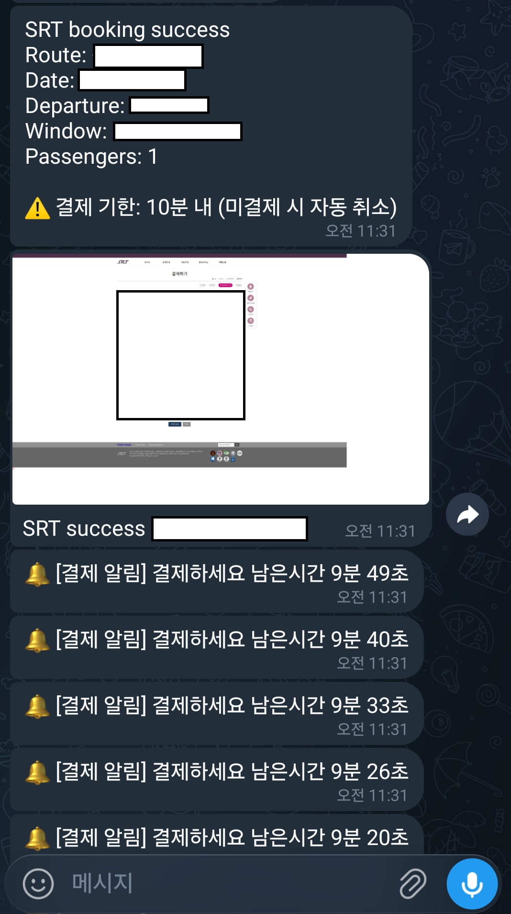

# SRTRunner Showcase

SRTRunner는 사용자가 원하는 조건의 기차표를 빠르고 안전하게 예매할 수 있도록 돕는 자동화 솔루션입니다. 사용자의 개입을 최소화하면서도, 다양한 예외 상황을 유연하게 처리하여 성공적인 예매를 보장합니다.

## 🚀 주요 기능

### 1. 지능형 예매 자동화
- **맞춤형 시간대 설정**: 사용자가 원하는 출발 및 도착 시간대(Time Window)를 설정하면, 해당 범위 내의 기차표만 선별하여 예매를 시도합니다.
- **좌석 상태 자동 인식**: 좌석의 매진 여부와 예약 가능 상태를 시각적 요소(버튼 유무 등)를 통해 자동으로 판별하고, 예약 가능한 좌석을 탐색하여 신속하게 예매를 진행합니다.

### 2. 사람과 유사한 자연스러운 동작 (Human-like Interaction)
- **자연스러운 클릭 및 이동**: 실제 사용자가 마우스를 움직이고 클릭하는 것과 유사한 패턴을 모방하여 비정상적인 기계적 접근으로 탐지되는 것을 방지합니다.
- **무작위 대기 시간 적용**: 새로고침과 클릭 등의 행동 사이에 불규칙한 대기 시간을 부여하여 탐지 시스템을 우회하고 보다 안전하게 동작합니다.

### 3. 예외 상황 및 팝업 자동 처리
- 예매 시도 중 흔히 발생하는 '잔여석 없음', '매크로 방지 경고' 등의 각종 팝업과 시스템 알림 창을 자동으로 인식하고 닫아, 중단 없이 예매 프로세스를 이어갑니다.

### 4. 안정적인 세션 유지
- 이전에 로그인하고 인증을 마친 브라우저 환경을 그대로 활용합니다. 이로 인해 번거로운 캡차(Captcha) 인증이나 잦은 로그인 과정을 생략하고 즉시 예매 작업에 돌입할 수 있습니다.

### 5. 하이브리드(반자동) 예매 방식
- 초기 로그인, 캡차 해결, 출발지/도착지 검색 등은 사용자가 직접 직관적으로 처리하고, 가장 지루하고 반복적인 '새로고침 및 예약 버튼 클릭' 작업만 시스템이 넘겨받아 수행할 수 있습니다.

### 6. 실시간 예약 성공 알림
- 기차표 예매가 성공적으로 완료되는 즉시, 사용자의 모바일 기기(메신저 등)로 예약 성공 알림 메시지를 발송합니다.
- 예매 완료 직후의 화면을 캡처하여 알림과 함께 전송함으로써, 사용자가 안심하고 결과를 즉각적으로 확인할 수 있게 돕습니다.

### 7. 법적 고지 및 면책 조항 (Disclaimer)
- **개인 프로젝트**: 본 프로젝트는 개인적인 프로그래밍 학습, 웹 자동화 기술 연구 및 포트폴리오 시연을 목적으로만 제작된 개인 프로젝트입니다. 본 프로그램의 소스코드 및 실행 파일은 어떠한 형태로도 외부로 배포, 공유, 또는 상업적으로 판매되지 않습니다.
